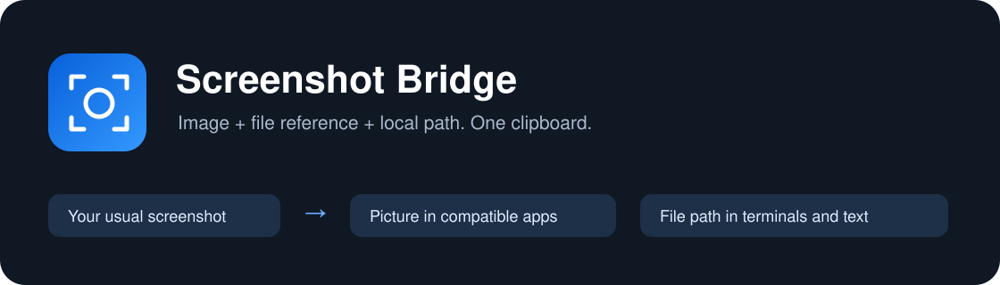

<div align="center">



**One screenshot. An image where it works. A path where you need it.**

[](https://github.com/alexmensak/screenshot-bridge/actions/workflows/ci.yml)
[](LICENSE)
[](#requirements)

[Download](https://github.com/alexmensak/screenshot-bridge/releases) · [Build](#build-from-source) · [Privacy](docs/PRIVACY.md) · [Report a bug](https://github.com/alexmensak/screenshot-bridge/issues/new/choose)

</div>

Screenshot Bridge is a small native macOS menu bar app for a familiar frustration: a screenshot is on your clipboard, but your IDE terminal needs a file path. Or the screenshot is saved to a folder, but nothing useful is on your clipboard.

It puts **PNG/TIFF image data, a file reference, and the local file path on the clipboard together**. Compatible image receivers can use the picture or attachment. Text receivers can use the path. Keep your usual screenshot shortcuts.

> The receiving app chooses the representation. Screenshot Bridge cannot force image-first pasting or detect every input’s capabilities. If a receiver chooses the wrong format, use **Copy Last Path Only** in the menu.

## Features

- Handles clipboard-only screenshots and newly saved screenshot files.
- Saves clipboard images as PNGs with unique names and real, reusable file paths.
- Follows the macOS screenshot save folder, with a manual folder override.
- Converts HEIF/HDR screenshot files to PNG for compatibility; HDR color preservation is not guaranteed.
- Quotes paths containing spaces or shell metacharacters by default.
- Provides Pause, Reveal Last Screenshot, Copy Last Path Only, and optional Launch at Login.
- Uses Apple frameworks with **no third-party runtime dependencies, uploads, telemetry, or updater**.

## Install and use

1. Download the archive for your Mac from [Releases](https://github.com/alexmensak/screenshot-bridge/releases): **arm64** for Apple silicon, **x86_64** for Intel. Extract it and move **Screenshot Bridge.app** into Applications.
2. Open it and read the first-launch explanation. Look for the camera viewfinder in your menu bar.
3. Allow clipboard and screenshot-folder access when macOS requests it. On versions with **Privacy & Security → Paste from Other Apps**, choose **Always Allow** if you want continuous clipboard monitoring.
4. Capture a screenshot, wait for it to finish saving, then paste.
5. Enable **Launch at Login** from the menu if desired. It is off by default for new installations.

Releases are **ad-hoc signed, not Developer ID signed or notarized**. macOS may block downloaded builds. Follow [Apple’s guidance for opening an app from an unidentified developer](https://support.apple.com/guide/mac-help/open-a-mac-app-from-an-unknown-developer-mh40616/mac) only if you trust the source, or build it yourself. Do not disable Gatekeeper globally. Checksums detect damaged downloads; they do not replace trusted signing.

| Action | Shortcut | Result |
| --- | --- | --- |
| Screenshot to clipboard | **⌃⇧⌘4** or **⌃⇧⌘3** | App saves a PNG and adds its path and file reference |
| Screenshot to a file | **⇧⌘4** or **⇧⌘3** | App copies the new screenshot with its original path |
| Screenshot toolbar | **⇧⌘5** | Screenshot captures are handled; recordings are ignored |
| Paste text in PyCharm or a terminal | **⌘V** | Receiver can paste the local path |
| Claude Code image paste | **⌃V** | Claude’s own clipboard handling, depending on the terminal |

For Claude Code in an IDE terminal, use **⌘V** to paste the path and ask Claude to inspect the image. Remote SSH sessions or containers need access to that file through a transfer or mounted folder. See [Apple’s screenshot guide](https://support.apple.com/en-ae/102646) and [Claude Code’s shortcuts](https://support.claude.com/en/articles/14554922-claude-code-user-faq).

## Privacy and permissions

**Read before enabling clipboard-image handling:** macOS does not reliably label clipboard images as screenshots. **Handle Clipboard Images** is enabled by default and saves any new single image-only copy, including images copied from other apps. Turn it off to process only newly saved screenshot files.

| Data | Handling |
| --- | --- |
| Clipboard images | Saved in `~/Pictures/Screenshot Bridge/`, with owner-only directory (`0700`) and files (`0600`) |
| Screenshots saved by macOS | Original file referenced; its contents and permissions are unchanged |
| HEIF/TIFF screenshot files | PNG compatibility copy in the private image directory |
| Text, URLs, existing file copies, mixed text/image copies, multiple items | Left alone by clipboard-image handling |
| Items marked concealed, transient, or autogenerated | Skipped |
| Clipboard at startup | Not replayed |

Images remain on disk until **you delete them**. There is no history database, but saved PNGs accumulate and can contain sensitive information. Other apps may read the clipboard; macOS Universal Clipboard may sync it. Backups and third-party sync tools may include saved files. Owner-only permissions do not isolate files from processes running as you, administrators, or services you authorize. See [Privacy](docs/PRIVACY.md) for the complete data flow.

No Accessibility, Screen Recording, Full Disk Access, administrator access, or account login is required. The app is not App Sandbox confined; macOS privacy controls govern clipboard and protected-folder access. Clipboard text is never executed as a command.

## Requirements

- **Run:** macOS 14+, Apple silicon or Intel.
- **Build:** Xcode 26+ with Swift 6.2+ selected and the macOS SDK.
- No external packages, API keys, or network connection are required by the app.

## Build from source

```sh
git clone https://github.com/alexmensak/screenshot-bridge.git
cd screenshot-bridge
./scripts/test.sh
./scripts/build.sh
open 'dist/Screenshot Bridge.app'
```

The script builds an ad-hoc signed `.app` in `dist/`. It refuses to overwrite an existing output; move the old bundle aside or choose a new destination:

```sh
./scripts/build.sh '/tmp/Screenshot Bridge.app'
ARCH=arm64 ./scripts/build.sh '/tmp/Screenshot Bridge-arm64.app'
ARCH=x86_64 ./scripts/build.sh '/tmp/Screenshot Bridge-x86_64.app'
```

Open `Package.swift` in Xcode or use your editor with Swift Package Manager. `swift run` is useful for development; **the built `.app` is the supported runtime for Launch at Login and macOS permission identity**. Scripts clean only their own temporary directories. They do not install the app, change screenshot settings, or register login items.

## Menu and troubleshooting

| Menu item | Purpose |
| --- | --- |
| Pause | Stops processing until resumed |
| Launch at Login | Registers/unregisters this app using Apple’s ServiceManagement API |
| Handle Clipboard Images | Enables saving image-only clipboard copies |
| Quote Paths for Terminals | Quotes spaces and metacharacters; disable for raw paths |
| Copy Last Path Only | Replaces clipboard content with the last path as plain text |
| Reveal Last Screenshot | Opens Finder at the last handled image |
| Choose Screenshot Folder… | Sets a watch folder without changing macOS capture settings |
| Use macOS Screenshot Folder | Restores automatic folder selection |

**Saved captures feel slow:** macOS may wait for the floating thumbnail before writing the file. Disable **Show Floating Thumbnail** under **⇧⌘5 → Options** if you prefer faster file copying. Clipboard checks run about every 0.2 seconds; folder events trigger scans with a three-second fallback.

**Nothing is copied:** check Pause, the watched folder, clipboard access, and Desktop/Downloads access. Copy a fresh image after granting access; existing clipboard contents are not replayed.

**An image field pastes text:** the receiver selected text. Try its attachment or image-paste action. Compatibility varies by app.

**An image is rejected:** input is capped at **100 MiB encoded and 40 megapixels before decoding**. Screenshot symlinks are rejected. Animated clipboard images become their first frame. Native ImageIO decoding runs in the app process; limits reduce resource abuse without providing complete decoder isolation.

**New text was preserved instead of a screenshot:** pending processing stops when the clipboard changes after the file is detected. A change before detection cannot reliably be associated with the original capture action.

**Startup fails:** move the built app to Applications, open that copy, and toggle Launch at Login. Check **System Settings → General → Login Items** for approval. The app runs until Quit; login startup is not a crash-restart service.

## Uninstall

Turn off Launch at Login, quit, and move the app to Trash. Saved images remain. Delete `~/Pictures/Screenshot Bridge/` yourself only after checking its contents.

## Development and status

Small, inspectable Swift code: [ClipboardBridge](Sources/BridgeCore/ClipboardBridge.swift), [PrivateImageStore](Sources/BridgeCore/PrivateImageStore.swift), [ScreenshotWatcher](Sources/BridgeCore/ScreenshotWatcher.swift), and [native app](Sources/ScreenshotBridge/App.swift).

Tests use **private named pasteboards and temporary files**, never the general clipboard. The CI workflow tests on a GitHub-hosted Mac and builds both architectures. See [Architecture](docs/ARCHITECTURE.md), [Testing](docs/TESTING.md), [Contributing](CONTRIBUTING.md), [Releasing](docs/RELEASING.md), and [Changelog](CHANGELOG.md).

**Initial preview validation:** all 18 tests passed locally on an Apple silicon Mac, and arm64/x86_64 release bundles compiled and passed extracted-bundle signature checks. Intel runtime and the complete manual application checklist remain unverified. Hosted CI could not start for the initial release; its badge is not evidence of a successful build.

This is an early release. Clipboard formats, local file privacy, and file watching have automated coverage. End-to-end compatibility with every app and macOS version is not claimed. Redact identifying paths, images, and logs in bug reports.

## Contributing, security, and license

Focused fixes, compatibility reports, documentation, and pull requests are welcome. Read [Contributing](CONTRIBUTING.md) and the [Code of Conduct](CODE_OF_CONDUCT.md). Report sensitive vulnerabilities [privately](https://github.com/alexmensak/screenshot-bridge/security/advisories/new); see [Security](SECURITY.md).

[MIT licensed](LICENSE). Built with Swift, AppKit, ImageIO, and ServiceManagement. Independent of Apple, JetBrains, Anthropic, and their products.
